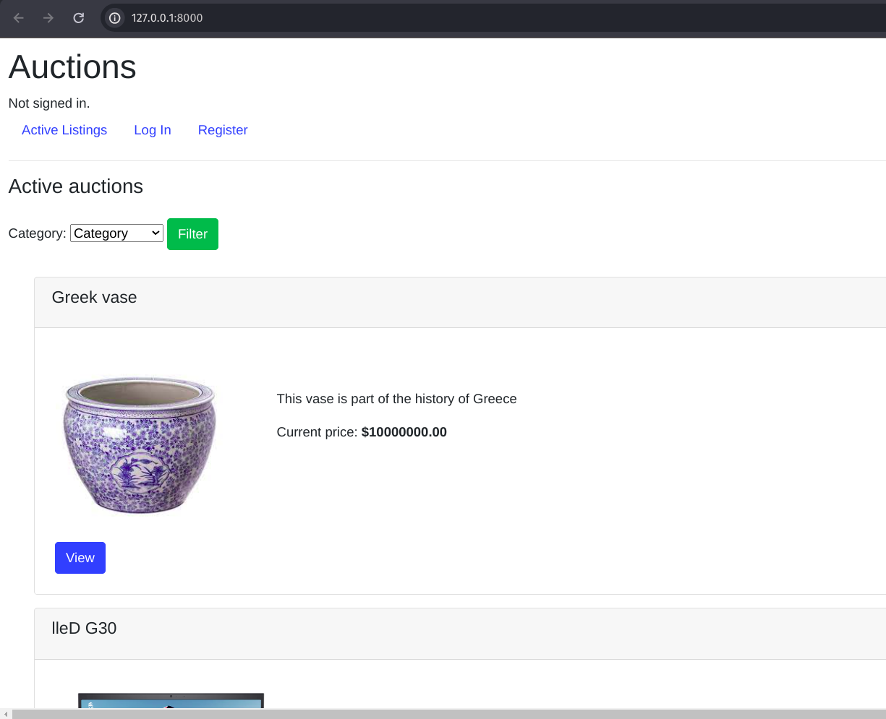

# Commerce

<!--  -->

<div style="text-align:center">
    
</div>


This is a simple e-commerce like project using django and sqlite3. It is possible register/login users, make bids, filter auctions listings, make comments on the listings and add them to a wishlist. You can also list new auctions and close them as well. The demo is [here](https://youtu.be/AXfDrMC3Z6A?si=zUXYXSK8DxNMi2Sn)


## Usage

After creating a virtual environment, install django

```
pip3 install django
```

Now, you can run the app by 

```
python manage.py runserver
```